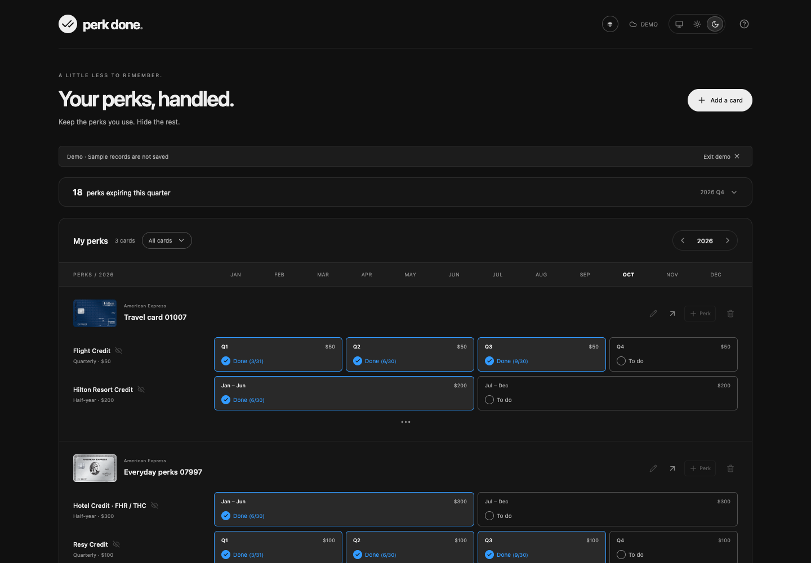

# Perk Done

A small Chrome extension for keeping track of credit card perks — without another account, a bank connection, or a server.

**TypeScript · React · Manifest V3 · Chrome Sync**



[View the compact popup](docs/screenshots/popup-dark.png)

## What's inside

- **Toolbar popup:** numbers only — total cards, remaining quarter perks, and annual fees / completed credit value with the difference.
- **Full dashboard:** jump straight to an equal-width annual timeline; the quarter deadline list is collapsed until you open it. Select any combination of cards with the multi-select filter. Monthly, quarterly, semiannual, and calendar-year perks share the same 12-month axis.
- **Restrained UI:** black, white, and gray with a blue accent for completion and earned value, with light, dark, and system themes. Theme preferences sync between extension surfaces and devices.
- **Multiple cards per product:** distinguish cards with nicknames and optional **4–5 digit suffixes**, including Amex's last five digits. Card titles use the nickname when set, otherwise the official product name, with the suffix appended on the same line. Existing suffixes can be edited without losing records.
- **One-click completion:** click an unfinished period to save today immediately. Click `Done(6/21)` to open a small anchored date editor with Save date and Undo completion. Historical periods can be logged today; upcoming periods cannot be completed.
- **Hidden perks:** use the eye icon beside a perk to hide it from the timeline and quarter's todo count. The card's `…` control says **Show hidden perks** on hover or keyboard focus and lets you restore them. Hidden perks retain their completion history.
- **Official card artwork:** bundled official issuer images, available offline in card headers and the product picker. Custom cards use a simple fallback icon.
- **Custom cards and perks:** add products not in the bundled catalog.
- **Actual validity dates:** set bank-reported ranges for cardmember-year credits and certificates instead of treating them as calendar-year credits.

English is the default language. The **中 / EN** button switches to Chinese or English; this preference syncs with the wallet. Completed cells and selected controls use a distinct soft gray fill in both themes. Unfinished periods use an empty circle; completed periods use a solid blue check circle and a thin blue border, preserving the date. The compact popup shows fees in gray, earned value in blue, and a small emoji with progress or net-earnings encouragement.

## Install locally / 本地安装

1. Open `chrome://extensions` in Chrome and enable **Developer mode / 开发者模式**.
2. Click **Load unpacked / 加载已解压的扩展程序** and choose the project's **`dist`** folder.
3. Pin Perk Done to the toolbar. Clicking it opens a compact popup.
4. Choose **Open dashboard / 打开完整面板** for card management and the annual timeline.

When upgrading from an earlier version, rebuild and click **Reload / 刷新** on the existing extension. Keep the same folder/extension identity; removing and reinstalling may delete local data. Existing cards, custom perks, optional four-digit suffixes, and completion dates are preserved.

```sh
# Node.js 24 LTS recommended
npm ci
npm run dev      # local preview; independent browser-local storage
npm test         # model, storage, migration, deadline and catalog tests
npm run build    # creates dist, ready for Load unpacked
npm run package  # creates release/perk-done-0.4.0.zip
```

Preview routes:

- `http://127.0.0.1:5173/` — dashboard
- `http://127.0.0.1:5173/popup.html` — popup layout
- Add `?demo=1` to either route to inspect sample data. Sample records are not saved.

The preview server is for development only. The installed extension contains its own code and catalog and does not need that server to run.

## Bundled card catalog

Edit **[`src/data/cards.json`](src/data/cards.json)** to maintain the products and benefits. No API, secret keys, recurring fetches, remote scripts, database, or scraping service is used.

**48 selectable products**, reviewed October 1, 2026:

| Issuer | Included families |
| --- | --- |
| American Express | Platinum (personal, Business, Schwab, Morgan Stanley), Gold / Business Gold, Green, Hilton Aspire / Surpass / Business, Marriott Brilliant / Bevy / Business, Delta Gold / Platinum / Reserve (personal and Business), Blue Cash Preferred / Everyday |
| Chase | Sapphire Preferred / Reserve / Reserve for Business, Marriott Boundless / Bountiful, Ritz-Carlton, IHG Premier / Business, Hyatt / Hyatt Business, Aeroplan, United Explorer / Quest / Club / Business / Club Business |
| Capital One | Venture X / Venture X Business |
| Citi | Strata Premier / Elite, AAdvantage Executive / Globe |
| Bank of America | Premium Rewards / Premium Rewards Elite |
| Column / Bilt | Bilt Obsidian / Palladium |
| Wells Fargo | Autograph Journey |

See the [complete catalog review](docs/catalog-review.md) for each product's official source, fee, tracked perks, eligibility decisions and deferred candidates. Zero-fee products without recurring credits are omitted from the picker. Previously added Hilton Honors cards remain accessible; Blue Cash Everyday stays eligible because it has a monthly streaming credit.

This is a **trackable-perk catalog**, not a list of every card's points earning, insurance, status, signup bonus, or conditional merchant offer. Enrollment requirements and issuer rules still apply. Business and co-branded variants have independent catalog IDs and notes. Relationship-specific rewards can be added as custom perks.

### Card artwork

Artwork is downloaded from public issuer and co-brand product pages and bundled in `public/cards/`. Products with verified artwork include a local `image` path and the original `imageSource` URL. There are 47 local images for 48 selectable products; Schwab currently uses the fallback icon rather than another card’s artwork. [`public/cards/sources.json`](public/cards/sources.json) records the exact sources. Existing cards pick up artwork from the catalog when loaded. The extension never fetches issuer images at runtime and needs no host permissions. Card imagery and trademarks belong to their respective issuers; the app uses them for product identification and is not affiliated with those issuers.

### Updating JSON

Each product has a stable `productId`, source URL, verification date, aliases, default `annualFee` in USD, and a `benefits` array. Each perk has a stable `id`, `name`, per-period `amount`, `frequency`, and a brief `note`.

Supported frequencies: `monthly`, `quarterly`, `semiannual`, `annual` (calendar year), and `manual` (explicit bank-reported validity dates).

Optional fields:

- `decemberExtra`: December bonus, such as Platinum Uber Cash.
- `valueLabel`: a non-cash label, such as a free-night point limit.
- `validFrom` / `validUntil`: validity boundaries for limited-time or discontinued perks.
- `expiryOffsetDays`: actual expiry after a calendar period. IHG United TravelBank uses 15 days, so a July–December deposit expires on January 15 of the next year.
- `source`: an additional perk-specific evidence link when needed.

Keep existing product and perk IDs unchanged to preserve completion records. Rebuild after editing the catalog. Existing saved cards read updated catalog values and new perks while retaining their instance IDs, custom perks, hidden settings, and manually entered dates. To discontinue a perk, set `validUntil` instead of deleting its ID. Removing a catalog ID deliberately is not a record-deletion or migration mechanism.

### Quarter todo rules

The popup and dashboard count **incomplete, visible periods expiring between today and the end of the current quarter**. Each monthly deadline is a separate item. Future months in the same quarter appear as “Upcoming / 未开始” and cannot be completed early. Expired periods are excluded. The focus always uses today's quarter even when browsing another timeline year.

Calendar-year and semiannual perks appear when their actual expiration falls in the current quarter. Bank-reported manual ranges are included only after you set them. A cardmember-year credit has no assumed December deadline. Changing a manual date range creates a separate completion key and retains the former record. The dashboard displays the currently configured range; to track multiple simultaneously valid certificates, add separate custom perks.

IHG TravelBank's expiry can cross the calendar year; the quarter todo checks the previous year's periods too. The timeline shows its half-year deposit period and explicitly labels the later expiration date. Manual periods are shown as a labeled date range spanning the row; they do not imply a January–December reset.

## Verification and sources

Catalog review date: **2026-10-01**. Exact amounts, eligibility, enrollment, billing-cycle reset dates, and certificate expiry should be checked against the issuer account. Card headers link to official terms.

Official sources used for the current catalog:

- [Amex Platinum benefits](https://global.americanexpress.com/card-benefits/view-all/platinum)
- [Platinum lifestyle benefits](https://www.americanexpress.com/en-us/credit-cards/credit-intel/amex-platinum-benefits/)
- [Platinum wellness and shopping](https://www.americanexpress.com/en-us/credit-cards/credit-intel/american-express-platinum-shopping-benefits/)
- [Platinum Uber One credit](https://global.americanexpress.com/card-benefits/detail/uber-one-credit/platinum)
- [Amex CLEAR+ benefit](https://www.americanexpress.com/en-us/travel/benefits/clear/)
- [Amex Gold](https://www.americanexpress.com/us/credit-cards/card/gold-card/)
- [Hilton Aspire](https://www.americanexpress.com/us/credit-cards/card/hilton-honors-aspire/)
- [Hilton Surpass](https://www.americanexpress.com/us/credit-cards/card/hilton-honors-surpass/)
- [Hilton Honors](https://www.americanexpress.com/us/credit-cards/card/hilton-honors/)
- [Chase Sapphire Preferred](https://creditcards.chase.com/rewards-credit-cards/sapphire/preferred)
- [Chase Sapphire Reserve](https://creditcards.chase.com/rewards-credit-cards/sapphire/reserve)
- [Marriott Boundless](https://marriott.chase.com/boundless)
- [Ritz-Carlton](https://marriott.chase.com/ritz-carlton)
- [Platinum annual fee](https://www.americanexpress.com/en-us/credit-cards/credit-intel/platinum-fee/)
- [Marriott Chase card fees](https://help.marriott.com/s/article/marriott-bonvoy-chase-credit-cards)
- [IHG Premier](https://creditcards.chase.com/travel-credit-cards/ihg-rewards-club/premier)

The discontinued Saks perk's 2026-06-30 cutoff is documented by [NerdWallet's report of American Express's confirmation](https://www.nerdwallet.com/travel/news/amex-platinum-saks-credit); its source is also stored in JSON. It remains for historical tracking and is excluded from later periods.

## Annual fees and used value

The popup uses the current calendar year across **all cards**, independent of dashboard filters. The first number sums actual annual fees (editable when adding or editing a card); the second sums the face value of completed credit periods. Example: Aspire $550 / $600 → **Net earned $50**. Undo reduces used value. Hidden completed credits still count.

A completion assumes the entire period credit was used. This is an estimate, not bank-verified reimbursement or a measure of actual profit. Free-night certificates have zero automatic cash value; signup bonuses, points, taxes and additional spending are excluded. Calendar perks are attributed to their timeline year, even when recorded later. Manual credits use the completion-date year, including retained records from earlier date ranges. Annual fees represent current configured fees, not a historical billing ledger; adjust for waivers, introductory offers or personal pricing. Catalog defaults are the public standard annual fees.

## Storage and privacy

Only the `storage` permission is requested. No content scripts, bank connection, transaction/history access, analytics, third-party fonts, or personal-data server.

Cards, custom perks, hidden states, actual validity dates, completion records, annual fee overrides, theme and language preferences use `chrome.storage.sync`. Sign in to the same Chrome account and enable sync to sync devices. Offline/disabled sync retains local data; the app cannot determine whether the account is actively syncing. Development-mode cross-device installs also need a consistent extension ID.

[Chrome Sync limits](https://developer.chrome.com/docs/extensions/reference/api/storage): 102,400 bytes total, 8,192 bytes per item, 512 items, plus write-rate limits. Data is separated by card and card/year. Quotas are checked before writes; errors appear in the active editor or page. A service worker serializes writes on one device. Chrome can still apply last-writer-wins behavior if different devices edit the same card/year concurrently; this version does not resolve distributed conflicts. Uninstalling can remove data. Keep a backup of important records outside the app.

`PRIVACY.md` describes what this release stores. The browser preview has a separate `localStorage` wallet and is not automatically migrated into extension storage.

## Browser checks

```sh
npm run build
npx playwright install chromium
npm run test:browser
```

The browser test uses a temporary Chromium profile and the actual unpacked extension. It checks popup configuration, Chrome storage persistence, five-digit suffixes, year isolation, hidden/restore behavior, theme syncing/system mode, one-click completion, anchored date correction/undo, multi-card filtering, numeric return totals, language sync, equal timeline widths, and narrow-screen layouts. It does not use your personal Chrome profile or verify your Google account's cross-device sync. Screenshots are written to ignored `test-results/`.

For an existing Chrome-for-Testing installation, pass its executable path through `CHROME_EXECUTABLE`.

## Publishing

`release/perk-done-0.4.0.zip` contains only the built extension. Source, dependencies, tests, screenshots, and personal records are excluded. The extension has not been published to the Chrome Web Store.

The GitHub repository stores the source. Rebuild locally for Load unpacked. Chrome Web Store distribution additionally needs a developer registration, a one-time registration fee, listing screenshots, and a publicly accessible privacy policy.
